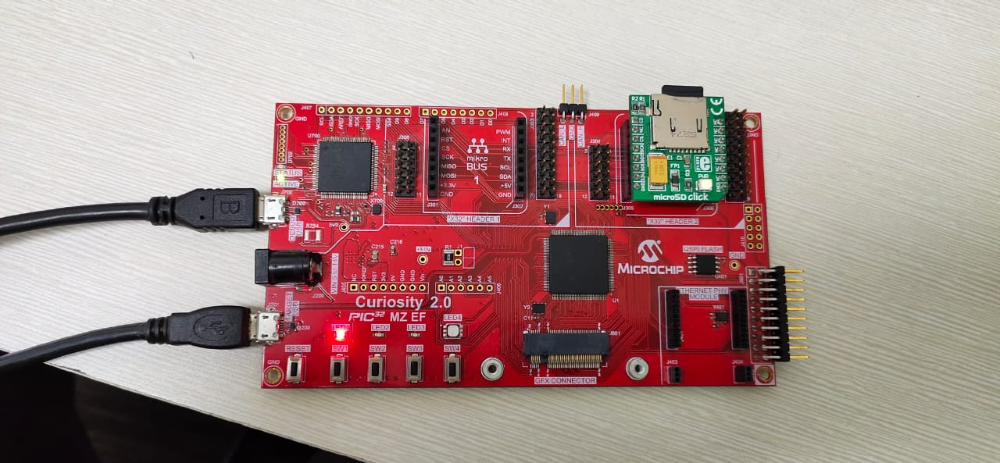

# USB MSD with Multiple Drives Application Demo on Curiosity PIC32MZ EF 2.0 Development Board

## Description
-----

>  This application demonstrates the creation of a USB device with multiple drives or logical
    units (LUN). The storage media - SD Card, acts as one drive, and the internal flash memory
    (NVM) acts as the second drive. Data transfer between a computer and the logical units 
    (SD Card / NVM) takes place through USB MSD class.When connected to a USB Host (PC) both the
    SD Card and the NVM appear as two separate drives on the Host PC.
    

## Modules/Technology Used:
-----
- USB Device
- NVM       
- SDSPI
- Memory Driver
- Core Timer

## Hardware Used:

- [Curiosity PIC32MZ EF 2.0 Development Board](https://www.microchip.com/Developmenttools/ProductDetails/DM320209)   
- [MICROSD CLICK from MikroElektronika](http://www.mikroe.com/click/microsd/)
- Micro SD Card

## Software/Tools Used:
 - [MPLAB Harmony v3 "csp" repo v3.5.2](https://github.com/Microchip-MPLAB-Harmony/csp/releases/tag/v3.5.2)
 - [MPLAB Harmony v3 "core" repo v3.5.2](https://github.com/Microchip-MPLAB-Harmony/core/releases/tag/v3.5.2)          
 - [MPLAB Harmony v3 "dev_packs" repo v3.5.0](https://github.com/Microchip-MPLAB-Harmony/dev_packs/releases/tag/v3.5.0)  
 - [MPLAB Harmony v3 "mhc" repo v3.3.3](https://github.com/Microchip-MPLAB-Harmony/mhc/releases/tag/v3.3.3)   
 - [MPLAB Harmony v3 "bsp" repository v3.5.0](https://github.com/Microchip-MPLAB-Harmony/bsp/releases/tag/v3.5.0)
 -  MPLAB Harmony Configurator Plugin v3.4.0
 - [MPLAB X IDE v5.30](https://www.microchip.com/mplab/mplab-x-ide)
 - [MPLAB XC32 Compiler v2.30](https://www.microchip.com/mplab/compilers)
 - [MPLAB X IPE v5.30](https://www.microchip.com/mplab/mplab-integrated-programming-environment)

## Setup:
- Mount the microSD click board on the mikro bus 2 interface (J306) on Curiosity PIC32MZ EF 2.0 Development Board.
- Insert a micro SD card into the microSD click board card slot. 
- Power the Curiosity PIC32MZ EF 2.0 Development Board from a Host PC through a Type-A male to micro-B USB cable connected to Micro-B port (J700).    
- Connect the Curiosity PIC32MZ EF 2.0 Development Board to the Host PC as a USB Device through a second Type-A male to micro-B USB cable connected to Micro-B port (J201).

## Programming binary/hex file:
- If you are not interested in installing development tools. The pre-built binary/hex file can be programmed to the target.
	### Steps to program the hex file using MPLAB X IPE.
	- Open MPLAB X IPE.
	- Select Device has "PIC32MZ2048EFM144".
	- Power the Curiosity PIC32MZ EF 2.0 Development Board from a Host PC through a Type-A male to Micro-B USB cable connected to Micro-B port (J105).
	- Once Power cable is connected, "Curiosity/Starter Kits PKOB4" hardware tool is identified as a programmer.
	- Browse to hex file (msd_multiple_luns_hex_file.hex).  
	- Click on program button. The device gets programmed in sometime.
	- Follow the steps in "Running the Demo" section below.

## Programming/Debugging Application Project:
- Open the project (msd_multiple_luns\firmware\pic32mz_ef_curiosity_v2.X) in MPLAB X IDE.
- Ensure "Curiosity/Starter Kits PKOB4" is selected as hardware tool to program/debug the application.
- Build the code and program the device by clicking on the "make and program" button in MPLAB X IDE tool bar.
- Follow the steps in "Running the Demo" section below.  

## Running the Demo:
- Reset or power cycle the devcie.
- Wait for the host computer to read the contents of the two media (SD Card and NVM).
- The device should appear as two new drives on the your personal computer.  
- The NVM media should appear as "Drive Name" and should have a sample “FILE.txt” file. 
	- The drive name for the SD card media depends on the micro SD card vendor. The drives can then be used to read or write files.
    - LED3 illuminates once Curiosity 2.0 board is enumerated as a Mass Storage Device by the USB host and LED2 will be illuminated when USB is not plugged.
- Note: Reprogramming the development board will cause any stored files in the NVM media to be erased.

## Comments:
 - While formatting the SD card, change allocation unit size to 32K. This helps in reading the contents of the SD card faster.
      (To change allocation unit size, Right click on Drive > Select Format > change Allocation unit size)
- This application is developed by applying a patch (available in folder "msd_multiple_luns\usb_repo_patch") to MPLAB Harmony v3 "usb" repository. 
If you need to reconfigure or regenerate this demo using MHC, please refer the "Notes.txt" file under "msd_multiple_luns\usb_repo_patch" folder.
              
## Revision: 
- v1.0 Released USB MSD demo with multiple drives.
