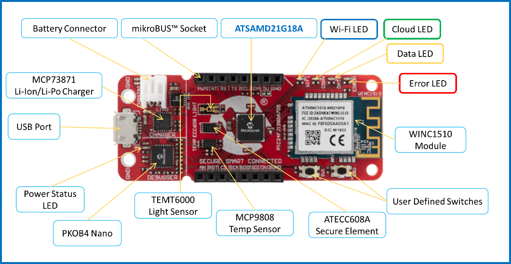

# Google IoT Application Demo on SAM D21 IoT Development Board

## Description
-----

> TBD

## Modules/Technology Used:
-----
- TBD
- TBD       
- TBD
- TBD

## Hardware Used:

- [SAM D21 IoT Development Board](https://www.microchip.com/Developmenttools/ProductDetails/DM320119)   

## Software/Tools Used:
 - [MPLAB Harmony v3 "csp" repo v3.5.2](https://github.com/Microchip-MPLAB-Harmony/csp)
 - [MPLAB Harmony v3 "dev_packs" repo v3.5.0)](https://github.com/Microchip-MPLAB-Harmony/dev_packs)  
 - [MPLAB Harmony v3 "mhc" repo v3.3.3)](https://github.com/Microchip-MPLAB-Harmony/mhc)    
 - [MPLAB Harmony Configurator Plugin v3.4.0]
 - [MPLAB X IDE v5.30](https://www.microchip.com/mplab/mplab-x-ide)
 - [MPLAB XC32 Compiler v2.30](https://www.microchip.com/mplab/compilers)
 - [MPLAB X IPE v5.30](https://www.microchip.com/mplab/mplab-integrated-programming-environment)
 - Any Serial Terminal application like Tera Term terminal application.

## Setup:
- TBD.

## Programming binary/hex file:
- If you are not interested in installing development tools. The pre-built binary/hex file can be programmed to the target.
	### Steps to program the hex file using MPLAB X IPE.
	- Open MPLAB X IPE.
	- Select Device has "ATSAMD21G17D".
	- Power the SAM D21 IoT Development Boardt from a Host PC through a Type-A male to Micro-B USB cable connected to Micro-B port (J105).
	- Once Power cable is connected, "PKOB nano" hardware tool is identified as a programmer.
	- Browse to hex file (getting_started_hex_file.hex).  
	- Click on program button. The device gets programmed in sometime.
	- Follow the steps in "Running the Demo" section below.

## Programming/Debugging Application Project:
- Open the project (getting_started\firmware\sam_d21_cnano.X) in MPLAB X IDE.
- Ensure "PKOB nano" is selected as hardware tool to program/debug the application.
- Build the code and program the device by clicking on the "make and program" button in MPLAB X IDE tool bar.
- Follow the steps in "Running the Demo" section below.  

## Running the Demo:
- TBD
- TBD

## Comments:
- TBD
               
## Revision: 
- v1.0 released "Google IoT Application Demo on SAMD21 IoT Development Board".
